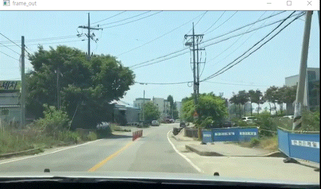

# Regular-polygon-finder
신경망 없이 순수 영상처리로 원하는 정 다각형을 검출합니다.
아래의 코드는 도로위의 빨간색 삼각형 표지판과 
파란색 사각형 표지판을 검출합니다.

팀프로젝트 입니다.
전체적인 구조와 정다각형 판별 알고리즘을 연구및 구현했습니다.
다른 팀원분이 영상소스와 개선 방안, 그리고 최적의 색 범위를 연구 및 구현했습니다.

